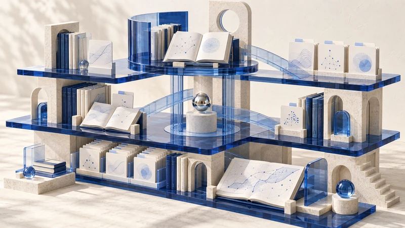
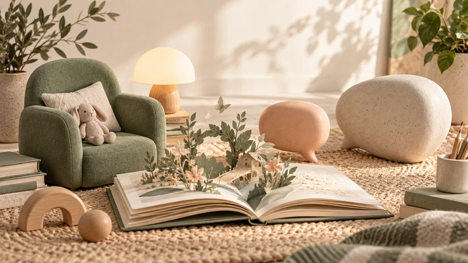

  

<h1 align="center">月明水清深 · MoonlitClear</h1>

<strong>AI 为基，认知破界。</strong>

做产品，也写文章。把想明白的事做出来，把做过的事沉淀成方法。

AI NATIVE · AGENTS & SKILLS · CREATOR TOOLS · KNOWLEDGE SYSTEMS

  <a href="https://aitongban.cloud/">个人主页</a> ·
  <a href="#正在做的产品">产品</a> ·
  <a href="#moonlit-skills">Skill 集合</a> ·
  <a href="#开源与实践">开源项目</a> ·
  <a href="mailto:z17362936917@163.com">联系我</a>

---

你好，我是月明，一名 AI Native 开发者。我在做一些与 **AI、内容创作和知识管理** 有关的产品，也分享项目里的问题、尝试与经验。

我关心的是：怎样让 AI 真正进入日常工作，让一次实践留下的经验，成为下一次可以调用的能力。

## 正在做的产品

<table>
<tr>
<td width="50%" valign="top">

<h3><a href="https://creatoros.aitongban.cloud">CreatorOS</a></h3>

<strong>从灵感到作品，让创作形成闭环。</strong>

本地 AI 内容生产操作系统，连接选题、脚本、内容制作与数据复盘。

内容创作 · AI 编导 · 创作工作流
</td>
<td width="50%" valign="top">

<h3><a href="https://github.com/zzyong24/thirdspace-vault-template">ThirdSpace</a></h3>

<strong>让知识库，从档案柜变成头脑地图。</strong>

把知识、工具与 Agent 放进同一个本地空间，支持下一次写作与项目工作。

知识管理 · 本地文件 · Agent 工作区
</td>
</tr>
<tr>
<td width="50%" valign="top">

<h3><a href="https://msgcollect.aitongban.cloud">Msg-collect</a></h3>

<strong>把看过的信息，变成留下的知识。</strong>

把视频、网页和 PDF 提取、转写为结构化笔记，让输入进入自己的知识系统。

信息采集 · 视频转录 · 结构化笔记
</td>
<td width="50%" valign="top">

<h3><a href="https://aitongban.cloud/">AI 童伴</a></h3>

<strong>从孩子的问题，开始一次交流。</strong>

围绕成长对话与家长看板，探索 AI 在教育陪伴中的应用。

AI 教育 · 问题探索 · 家长参与
</td>
</tr>
</table>

## Moonlit Skills

把创作过程里反复使用的方法，整理成可独立安装的 Skill。每个 Skill 一个仓库，有清晰的职责、使用说明和品牌图。

**[从内容引擎开始 →](https://github.com/zzyong24/moonlit-content-engine)**　·　**[浏览全部 Skill →](https://github.com/zzyong24/moonlit-content-engine#技能导航)**

| 想做什么 | 可以从这里开始 |
| :--- | :--- |
| 找选题、做研究 | [选题雷达](https://github.com/zzyong24/moonlit-topic-radar) · [选题引擎](https://github.com/zzyong24/moonlit-topic-engine) · [对标研究](https://github.com/zzyong24/moonlit-benchmark-research) |
| 把想法写清楚 | [口述转大纲](https://github.com/zzyong24/moonlit-oral-to-outline) · [去 AI 味](https://github.com/zzyong24/moonlit-de-ai-perception) · [公众号文章](https://github.com/zzyong24/moonlit-wechat-article) |
| 把机制讲明白 | [解释配图](https://github.com/zzyong24/moonlit-material-illustration) · [宇航员插画](https://github.com/zzyong24/moonlit-astronaut-illustration) · [解说画布](https://github.com/zzyong24/moonlit-explainer-canvas) |
| 制作视频与平台内容 | [视频脚本](https://github.com/zzyong24/moonlit-video-script) · [HTML 视频](https://github.com/zzyong24/moonlit-html-video) · [小红书图文](https://github.com/zzyong24/moonlit-xiaohongshu) · [抖音转写](https://github.com/zzyong24/moonlit-douyin-transcribe) |
| 沉淀自己的方法 | [Skill 创建与维护](https://github.com/zzyong24/moonlit-skill-creator) |

## 开源与实践

| 项目 | 我在探索什么 |
| :--- | :--- |
| [Hermes OpenClaw Book](https://github.com/zzyong24/hermes-openclaw-book) | AI Agent 架构实战手册：阅读、对照、动手实践。 |
| [Skills Judgment](https://github.com/zzyong24/skills-judgment) | Skill 的评估与迭代，让技能库随使用持续进化。 |
| [AITerm](https://github.com/zzyong24/AITerm) | 让终端成为 AI 操作界面，连接工具与工作上下文。 |
| [mkd2pic](https://github.com/zzyong24/mkd2pic) | 把 Markdown 转成适合阅读与分享的图片。 |

## 在别处找到我

我会持续分享产品实践、AI 工作流和创作过程。关于产品、开源项目与合作，欢迎交流。

[个人主页](https://aitongban.cloud/) · [抖音](https://www.douyin.com/user/MS4wLjABAAAAZ0Bu__OWbtZcIeDYZ9kLtt8mOGJ7nW9m0w19oj8w4uI) · [B 站](https://space.bilibili.com/431834368) · [小红书](https://www.xiaohongshu.com/user/profile/5fc519460000000001003129) · [邮件](mailto:z17362936917@163.com)

---

BUILD USEFUL THINGS. SHARE WHAT YOU LEARN.

